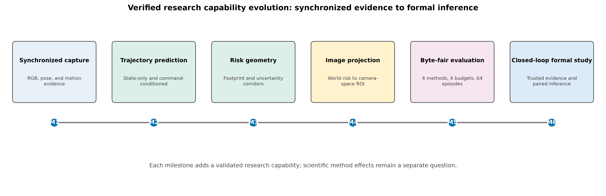
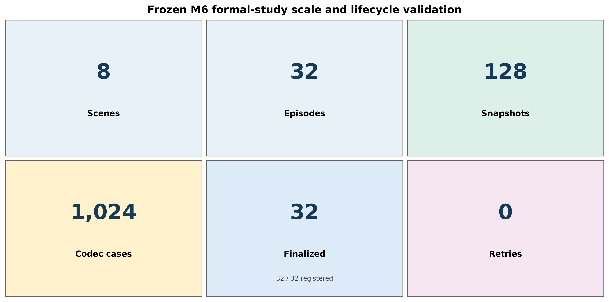
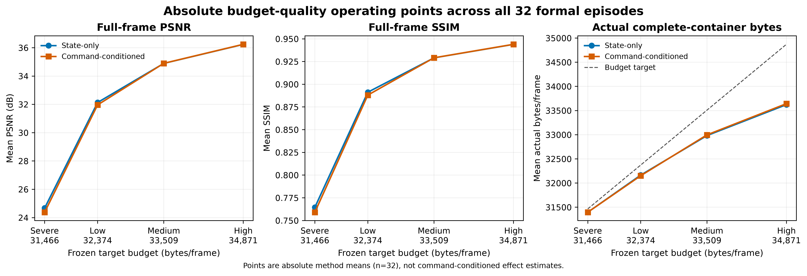
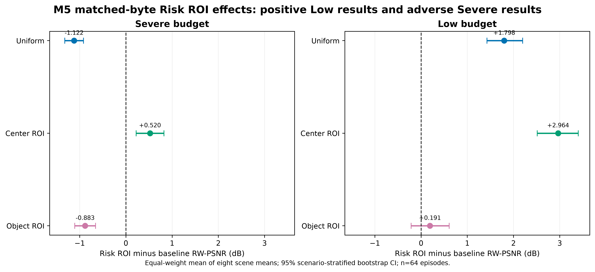

# Risk-Aware Visual Communication for Mobile Robots

An interpretable Webots research platform for studying how predicted robot motion can guide visual communication under strict byte budgets. The repository now spans synchronized simulation evidence, trajectory and risk modeling, camera-space allocation, matched-byte compression, trusted lifecycle evidence, and preregistered episode-level analysis.

The central research question is: **when visual communication is byte-constrained, does knowledge of a robot's predefined future command improve which image regions receive quality?** The completed M6 study provides a rigorous negative baseline for that question, while the broader project establishes a reusable end-to-end evaluation capability.



*Figure 1. Verified capability evolution from M1 synchronized capture through M6 closed-loop formal inference. This is a project-level progress view, not a claim that every later scientific hypothesis succeeded. The vector figure and checked source table are in [`docs/figures/`](docs/figures/).*

## Verified research progress



*Figure 2. Scale and lifecycle validation of the frozen M6 formal study: 8 scenes, 32 episodes, 128 snapshots, 1,024 codec cases, 32/32 finalized identities, and 0 retries. Counts are re-extracted from the preregistration and canonical runtime, aggregate, process, final-marker, and ownership-terminal evidence.*

The verified capability stack includes:

1. synchronized RGB, robot-state, and command evidence in Webots;
2. independent state-only and command-conditioned trajectory predictors;
3. footprint-aware uncertainty corridors and camera projection;
4. deterministic tiled-JPEG allocation with complete-container byte accounting;
5. provenance that rejects actual-future, combined-mask, fallback, and replacement leakage;
6. canonical runtime, aggregate, joint-validation, finalization, and episode-level analysis.

These are engineering and evaluation advances. They do not, by themselves, establish a positive method effect or improved navigation safety.

## End-to-end system


*Figure 3. Trusted evidence path from the Webots scene to paired episode inference. Allocation uses predicted trajectories only; actual-future motion never enters either method.*

The two M6 baselines isolate command information while sharing all other definitions:

- **State-only risk ROI:** predicts a 2 s constant-twist trajectory from current robot state.
- **Command-conditioned risk ROI:** uses the same current state plus the predefined wheel-command schedule already available at decision time.

Both use the frozen e-puck footprint, uncertainty corridor, camera projection, rasterization, codec, and four budgets. Actual future trajectories, combined or oracle masks, fallback, and replacement are prohibited.

## Budget-quality behavior



*Figure 4. Absolute full-frame PSNR, SSIM, and charged complete-container bytes at the four frozen targets. Each point is a method mean across all 32 validated episodes. Quality increases strongly from Severe to High; the two methods remain close, and actual charged bytes stay below their targets.*


*Figure 5. Genuine budget-quality improvement for a deterministic sample: the lexicographically first TCOBR-eligible episode (S2, seed 630200), snapshot 0, fixed State-only method, shown at the Severe and High budget endpoints. Selection did not inspect image quality or method effect. PSNR rises from 24.89 to 35.89 dB and SSIM from 0.756 to 0.933 in the frozen evidence.*

This budget trend is a **system-level compression result**, not evidence that command conditioning improves allocation. At the method level, command-conditioned minus state-only full-frame quality is negative at Severe and Low and near zero at Medium and High.

## Prior matched-byte evidence

M5 compared a heuristic Risk ROI against three explicit baselines over 64 episodes. The narrow low-budget finding is positive against Uniform and Center ROI, but it is not universal and does not carry over as a general M6 claim.



*Figure 6. M5 Risk ROI minus Uniform, Center ROI, and Object ROI in risk-weighted PSNR (RW-PSNR), with 95% scenario-stratified bootstrap intervals (`n=64`). Low-budget gains over Uniform (+1.798 dB) and Center ROI (+2.964 dB) are shown alongside the null-compatible Object ROI comparison (+0.191 dB, CI crosses zero) and the adverse Severe results versus Uniform (-1.122 dB) and Object ROI (-0.883 dB). No baseline is hidden.*

## Formal M6 study

| Item | Frozen definition |
| --- | --- |
| Dataset | 32 independent formal episodes, 8 scenes, 4 episodes per scene |
| Seeds | 630100-630803 in the immutable v3 extension |
| Snapshots | 4 per episode; 128 total |
| Codec cases | 2 methods x 4 budgets x 4 snapshots = 32 per episode; 1,024 total |
| Budgets | Severe, Low, Medium, High; actual complete-container bytes |
| Statistical unit | Episode; snapshots are pooled before TCOBR inference |
| Primary measure | Trajectory-Critical Obstacle Boundary Recall (TCOBR) |
| Primary contrast | Command-conditioned minus state-only, Severe and Low equally weighted |
| Inference | Within-scene episode bootstrap, 10,000 replicates, seed `20260724` |
| Support rule | PASS only when the 95% percentile-CI lower bound is above zero |

TCOBR uses the method-independent union of the frozen planned and state trajectory corridors to identify critical obstacles. Eligibility requires a sufficiently large clipped projection and enough original-image Canny boundary edges. An episode with no eligible instance remains undefined; it is never imputed as zero or one. See the [M6 protocol](docs/m6_followup_evaluation_protocol.md) and [v3 preregistration](docs/results/m6_multiscene_v3_preregistration.json).

## Scientific findings and limitations

### Eligibility and support gates


*Figure 7. Eligibility for all 32 registered episodes. S1, S7, and S8 contain no eligible episodes; the amended analysis includes all 17 eligible episodes from S2-S6 and weights those five scenes equally.*


*Figure 8. Eligibility-conditional TCOBR paired effects. Every budget and the Severe/Low primary contrast are exactly zero, with 95% CIs [0, 0]. This unchanged null-result figure is deliberately placed with the scientific findings rather than used as the project hero visual.*

- **Original eight-scene gate: NOT EVALUATED.** Three scene strata contain no eligible trajectory-critical obstacle instances.
- **Eligibility-conditional gate: FAIL.** Command-conditioned minus state-only TCOBR is **0.000**, 95% CI **[0.000, 0.000]**, with `n=17` eligible episodes.
- The zero interval does not prove universal equivalence; it applies only to the frozen scenes, methods, budgets, eligibility rule, and metric.

### Method-level secondary effects


*Figure 9. Mean command-conditioned minus state-only effects across all 32 validated episodes. Severe and Low retain their observed full-frame quality degradation; zero, negative, byte, and ROI-area effects are shown without benefit framing.*

| Budget | PSNR (dB) | SSIM | Charged bytes/frame | ROI area (percentage points) |
| --- | ---: | ---: | ---: | ---: |
| Severe | -0.2949 | -0.00537 | +0.3 | +0.003825 |
| Low | -0.1692 | -0.00318 | -12.5 | +0.003825 |
| Medium | +0.0053 | +0.00007 | +14.5 | +0.003825 |
| High | +0.0081 | +0.00010 | +20.4 | +0.003825 |

Further limitations:

- Only 17 of 32 formal episodes are TCOBR-eligible, and three full scene strata are empty.
- TCOBR measures boundary reconstruction, not detector accuracy, navigation success, collision rate, or operator performance.
- The 160 x 120 camera, static AABB scenes, deterministic schedules, and tiled-JPEG prototype limit external validity.
- Both methods are heuristic geometric baselines; neither learns budget-dependent task utility.
- Evidence is limited to controlled Cyberbotics Webots R2025a simulation with a simulated e-puck, not physical networks or real robots.

## Contributions and next direction

The project contributes an interpretable mapping from predicted robot-motion risk to visual priority, strict method-specific input boundaries, byte-fair reconstruction evidence, and a preregistered evaluation that preserves null, adverse, and undefined results. It does **not** establish a state-of-the-art allocator, calibrated collision probability, or improved robot safety.

The next milestone is **budget-conditioned visual value of information**: combine risk, visible coverage, downstream task utility, and actual incremental bytes. It requires new disjoint, eligibility-rich data and deterministic oracle/greedy baselines before any learned policy. See the [Risk-VoI experiment plan](docs/m6_risk_voi_experiment_plan.md).

## Reproducibility

Use Python 3.11 from the repository root:

```powershell
.\.venv\Scripts\python.exe -m pip install -r requirements.txt
.\.venv\Scripts\python.exe -m unittest discover -s tests
.\.venv\Scripts\python.exe -m scripts.plot_m6_publication_figures
```

The plotting command reads only the checked JSON/CSV tables in [`docs/figures/data/`](docs/figures/data/) and regenerates all nine SVG/360-dpi PNG pairs. Release maintainers with the immutable local evidence can audit and re-extract the tables with:

```powershell
.\.venv\Scripts\python.exe -m scripts.plot_m6_publication_figures --refresh-source-data
```

The refresh validates frozen counts, lifecycle outcomes, budgets, M5/M6 effects, and qualitative image hashes. It does not launch Webots or write experimental evidence. Full runtime evidence remains ignored under `data/m6a/`; the compact checked source tables make the landing-page figures reproducible without redistributing that corpus.

## Artifact map

- [Figure catalog and source mapping](docs/figures/README.md)
- [Final M6 report](docs/m6_final_report.md)
- [M6 scientific protocol](docs/m6_followup_evaluation_protocol.md)
- [Frozen v3 preregistration](docs/results/m6_multiscene_v3_preregistration.json)
- [Eligibility-conditional amendment](docs/results/m6_v3_eligibility_conditional_analysis_amendment.json)
- [M5 statistical report](docs/m5e_statistical_analysis_report.md)
- [Independent M5 acceptance](docs/m5e_f_independent_acceptance_report.md)
- [M5 multi-scene protocol](docs/m5e_multiscene_offline_evaluation_protocol.md)
- Frozen local M6 analysis: `results/m6_multiscene_formal_v3/analysis_summary.json`

Selected prior milestone figures remain available for audit: [M2 trajectory ADE](docs/assets/m2_method_comparison_ade.png), [M3 world-risk geometry](docs/assets/m3_world_risk_overview.png), [M5 primary paired effects](docs/assets/m5e_primary_paired_effects.png), and [M5 scene/budget heterogeneity](docs/assets/m5e_scene_budget_effects.png).

## Repository structure

| Path | Purpose |
| --- | --- |
| `simulator/` | Webots worlds, trusted controller, and runtime adapters |
| `navigation/`, `risk_map/`, `perception/` | Trajectory prediction, risk geometry, and camera projection |
| `compression/`, `evaluation/` | Byte-fair tiled JPEG and image-quality metrics |
| `scripts/` | Evidence production, validation, analysis, and plotting entry points |
| `tests/` | Unit, integration, tamper, lifecycle, and statistical regressions |
| `docs/` | Protocols, decisions, reports, roadmap, and publication figures |
| `data/`, `results/` | Ignored local runtime evidence and frozen generated analyses |
