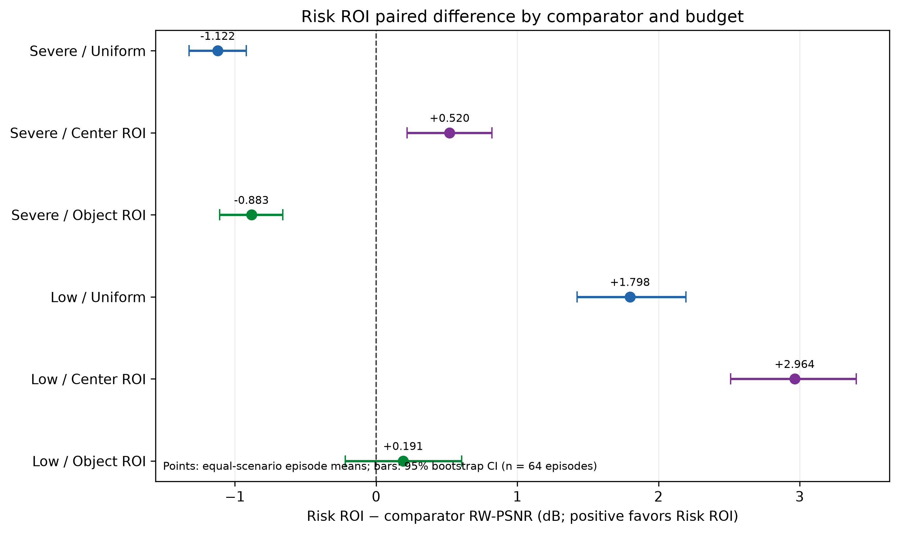
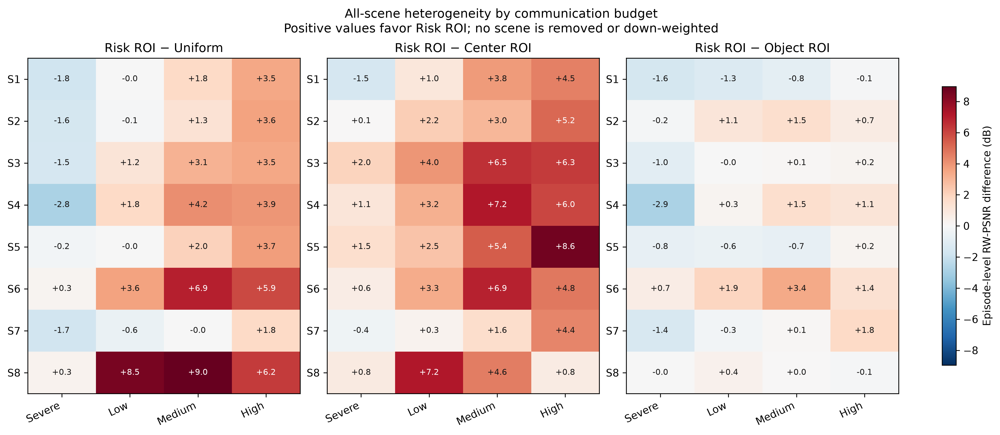

# Risk-Aware Task-Oriented Visual Communication for Mobile Robots

This repository studies trajectory-conditioned, geometry-grounded, image-space collision-risk-aware visual resource allocation for remote mobile-robot navigation. All evidence is from controlled Cyberbotics Webots R2025a simulation with a simulated e-puck; it is not real-robot, deployed-system, or physical-network evidence.

## Research Question

At a matched communication budget, can allocating visual quality to projected trajectory-relevant collision-risk regions preserve risk-weighted image information better than Uniform compression, a fixed Center ROI, or an Object ROI?

## System Overview

`RGB frame + robot state + command schedule → predicted trajectories → geometry-based obstacle risk → projected image-risk mask → tiled-JPEG allocation → matched-byte reconstruction → offline episode-level evaluation`

The four frozen allocation methods are **Uniform**, **Center ROI**, **Object ROI**, and **Risk ROI**. Risk ROI is an interpretable heuristic baseline, not a learned policy or calibrated collision-probability model.

## Current Status

Milestone 5E-E formal statistical analysis is complete, and Milestone 5E-F independently reproduced and formally accepted the frozen evaluation. Milestone 5 is closed: its formal data, statistical outputs, and conclusions are frozen.

M6 may now prepare its protocol and counterfactual data, but model training has not started. The detailed [M5E-E statistical report](docs/m5e_statistical_analysis_report.md) and [M5E-F acceptance report](docs/m5e_f_independent_acceptance_report.md) define the supported claims and acceptance checks.

## Formal Evaluation

| Item | Frozen formal evaluation |
| --- | --- |
| Statistical unit | Episode; four snapshots are aggregated before inference |
| Coverage | 64 episodes, 256 formal frames, 8 scenes |
| Reconstructions | 4,096 method-budget reconstructions |
| Methods | Uniform, Center ROI, Object ROI, Risk ROI |
| Budgets | 4 matched communication budgets |
| Replacements | 0 |
| Inference | Paired, scenario-stratified bootstrap; 10,000 replicates |
| Fairness | 0.5% complete-container-byte tolerance |

Frames are not treated as independent statistical samples. The primary metric is episode-level, equal-scenario mean risk-weighted PSNR (RW-PSNR); positive paired differences favor Risk ROI.

## Main Findings

| Budget | Risk ROI − comparator | Effect (dB) | 95% CI |
| --- | --- | ---: | --- |
| Severe | Uniform | -1.122 | [-1.326, -0.919] |
| Severe | Center ROI | +0.520 | [+0.219, +0.820] |
| Severe | Object ROI | -0.883 | [-1.108, -0.660] |
| Low | Uniform | +1.798 | [+1.422, +2.194] |
| Low | Center ROI | +2.964 | [+2.511, +3.400] |
| Low | Object ROI | +0.191 | [-0.219, +0.606] |

Risk ROI is **not universally superior**: its outcome depends on budget and scenario. It shows positive primary effects relative to Center ROI at both primary budgets, but does not consistently outperform Object ROI. Severe-budget negative results expose a failure mode of overly concentrated risk allocation. Risk-region gains also carry full-frame and background-quality costs.

Substantial scene heterogeneity is retained in the formal analysis: S7 contains unfavorable paired results, whereas S8 has unusually large low-budget effects. No scene was deleted or down-weighted. See the [formal statistical report](docs/m5e_statistical_analysis_report.md) for all scenes, budgets, failure modes, and exploratory diagnostics.

## Key Figures


*World-coordinate risk overview from the accepted Webots validation snapshot. It visualizes projected trajectory/risk geometry in controlled simulation; it is not a robot-safety or navigation-success result.*


*Stable-window 2.0 s trajectory-prediction ADE from controlled Webots simulation. The log y-axis reports metres; the public CSV contains only this retained method/horizon comparison.*



*Primary M5E-E episode-level RW-PSNR paired effects. Points are equal-scenario means and bars are 95% scenario-stratified bootstrap CIs (`n=64` episodes); positive values favor Risk ROI. Simulation-only offline image-quality evidence.*



*All eight formal scenes across four budgets. Each cell is an episode-level RW-PSNR difference in dB; the symmetric scale and numeric labels retain both unfavorable S7 and large S8 effects without changing their weight.*

Additional diagnostic figures, including full-frame/background trade-offs, are available through the [M5E-E report](docs/m5e_statistical_analysis_report.md).

## Reproducibility

Use Python 3.11 and Webots R2025a from the repository root:

```powershell
.\.venv\Scripts\python.exe -m pip install -r requirements.txt
.\.venv\Scripts\python.exe -m unittest discover -s tests
.\.venv\Scripts\python.exe .\scripts\plot_m5e_publication_figures.py
.\.venv\Scripts\python.exe .\scripts\validate_m5e_statistical_analysis.py
```

The formal M5 data are intentionally held out and frozen. Full formal-validation and isolated-reproduction commands are documented in the [acceptance report](docs/m5e_f_independent_acceptance_report.md); generated evidence remains under ignored `data/` and `results/` paths.

The read-only [M5E-D closeout](docs/m5e_d_closeout_report.md) records the engineering audit and its reproducible descriptive summary. The next experiment-design step is the [M6 baseline and ablation protocol](docs/m6_followup_evaluation_protocol.md); it requires independent data and does not authorize immediate Risk-VoI training.

## Limitations

- Controlled Webots simulation and offline evaluation only.
- No real-world robot validation, closed-loop navigation safety result, or physical-network evaluation.
- The current allocator is heuristic; its risk score is not a calibrated collision probability.
- Risk ROI can sacrifice full-frame and background quality.
- Results are budget- and scenario-dependent.
- Formal M5 frames cannot be reused for M6 model development.

## Next Research Stage

**Budget-Conditioned Risk-Visual Value-of-Information Allocation** asks: for each tile and candidate quality, what marginal task or safety utility is gained per additional actual encoded byte?

Before any model training, M6 requires frozen utility definitions, independent train/validation/test episode splits, new counterfactual tile-quality data, and trajectory-critical obstacle recall as its first downstream task. The M5 formal data remain held out. See the [M6 experiment plan](docs/m6_risk_voi_experiment_plan.md).

## Repository Structure

- `simulator/`: Webots worlds, controllers, scenarios, and adapters.
- `navigation/`, `risk_map/`, `perception/`: trajectory, risk, and projection components.
- `compression/`, `evaluation/`: tiled-JPEG allocation and matched-budget image-quality evaluation.
- `scripts/`: reproducible generation, validation, analysis, and figure commands.
- `tests/`: unit and regression tests.
- `docs/`: protocols, reports, decisions, curated public figures, and compact public summaries.

## Quick Start

The project is not a one-command reproduction package because large generated Webots evidence is intentionally ignored. Start with the tests and curated publication figures above; consult [research protocol](docs/research_protocol.md), [M5E evaluation protocol](docs/m5e_multiscene_offline_evaluation_protocol.md), and [progress](docs/progress.md) before generating new data.
