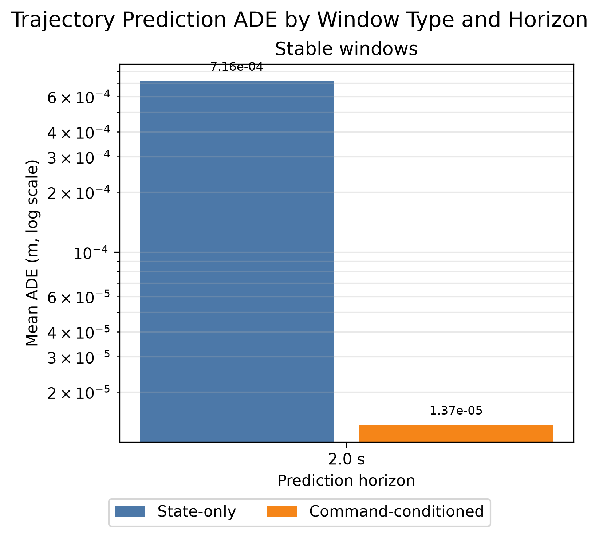
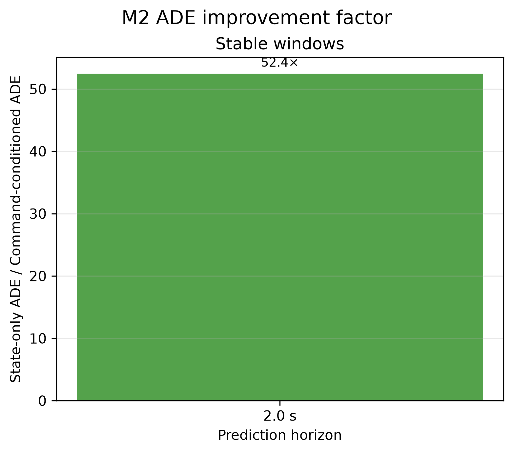
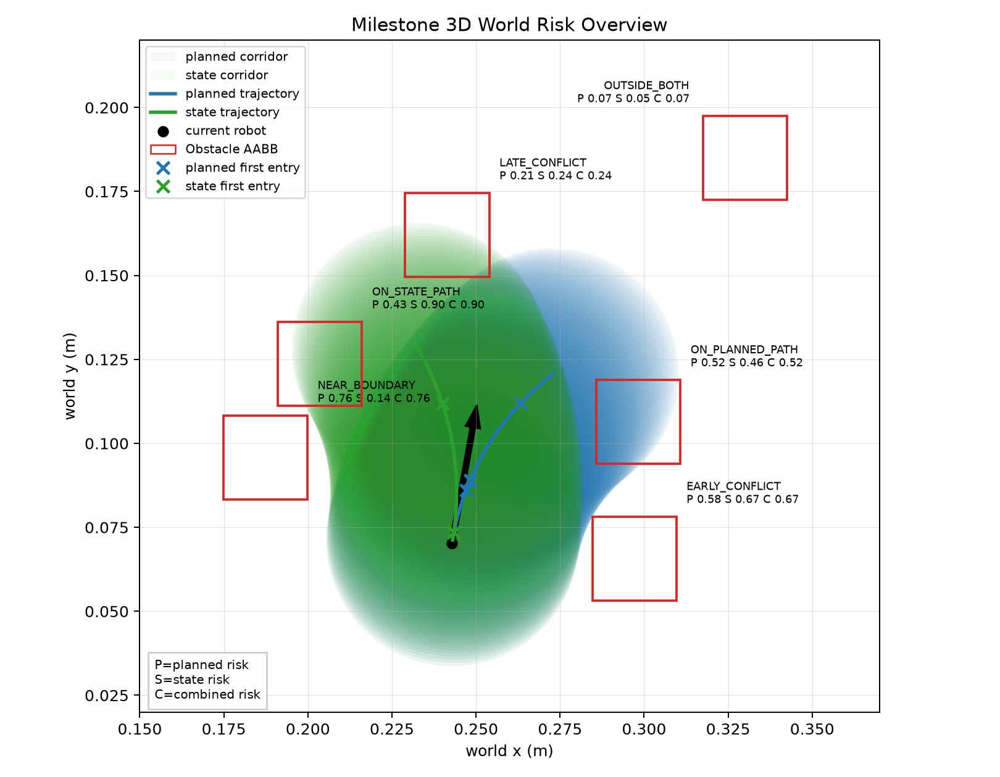
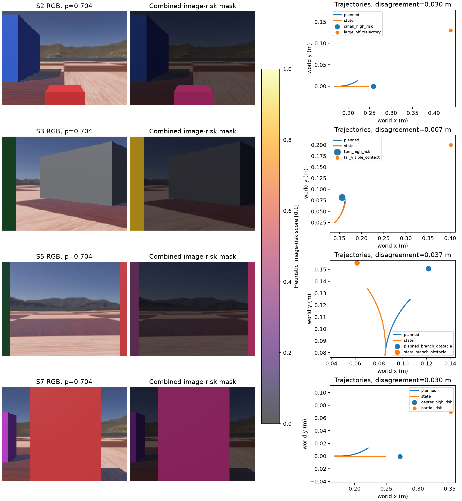

# Risk-Aware Visual Communication

Research prototype for trajectory-conditioned, collision-risk-aware visual communication in remote robot navigation.

This repository is an ongoing Webots simulation study. The current results are from controlled Webots/e-puck experiments, not real-world robot performance, deployed robot behavior, or physical hardware trials.



The ADE figure is generated from the curated M2 summary CSV by `scripts/plot_m2_method_comparison.py`. Its log-scaled y-axis makes the retained non-zero values readable across orders of magnitude; the currently published CSV contains only the 2.0 s stable-window comparison, so it does not imply unavailable transition-window or 1.0 s results. Stable windows exclude command-transition guard intervals as defined by the M2 evaluator. ADE is measured in metres, and all values are from controlled Webots simulation rather than physical-robot performance.



## Research Question

Under the same or closely matched communication budget, can trajectory- and collision-risk-driven visual resource allocation preserve safety-relevant obstacle information better than uniform compression, a fixed center ROI, or an object-only ROI?

## Motivation

Remote navigation often sends visual observations through constrained communication links. A uniform visual budget can waste bytes on low-risk background regions while under-preserving obstacles near the robot's likely path. This project tests whether predicted trajectory and geometric collision-risk cues can drive a more relevant allocation of image quality.

## Current System

- Simulator: Cyberbotics Webots R2025a on native Windows.
- Robot: simulated differential-drive e-puck with a forward RGB camera.
- Data source: synchronized RGB frames, Webots Supervisor ground-truth state, command schedules, and static AABB obstacle layouts.
- Current pipeline: trajectory prediction, geometric risk scoring, camera projection, image-risk masks, tiled-JPEG spatial allocation, matched-byte offline image-quality evaluation, and episode-level statistics.
- Not implemented: real robot hardware, ROS 2, learned allocation, networking, remote perception, or closed-loop navigation claims.

## Methods

1. Generate controlled Webots episodes with fixed command schedules and known obstacle geometry.
2. Predict future motion with a State-only constant-twist baseline and a Command-conditioned differential-drive rollout.
3. Score obstacle risk from trajectory corridor clearance and Time-to-Conflict (`TTCf`).
4. Project world-coordinate obstacle risk into camera image space.
5. Allocate tiled-JPEG quality with four policies: Uniform, Center ROI, Object ROI, and Risk ROI.
6. Compare methods at matched actual complete-container bytes.



## Key Results

Trajectory prediction was evaluated on a dedicated in-place Webots validation episode. The CV-relevant stable-window ADE values are:

| Condition | Horizon | Window set | ADE |
| --- | ---: | --- | ---: |
| State-only | 2.0 s | stable windows only (`all_stable`) | `7.16e-4 m` |
| Command-conditioned | 2.0 s | stable windows only (`all_stable`) | `1.37e-5 m` |

Source: [docs/results/m2_in_place_summary_metrics.csv](docs/results/m2_in_place_summary_metrics.csv), copied from the generated `results/m2_trajectory/summary_metrics.csv` without changing the values. The evaluator defines horizons in [scripts/evaluate_m2_trajectory.py](scripts/evaluate_m2_trajectory.py).

For the later M5E compression study, engineering evidence is complete through episode-level offline statistics. The main result is heterogeneous rather than a general superiority claim: H1 is not fully supported, while H2/H3 have direction-specific support under their frozen scenario contrasts. These are offline image-quality findings over a heuristic risk proxy, not collision-rate or navigation-success findings.



## Repository Structure

- `simulator/`: Webots worlds, controllers, scenario definitions, and adapters.
- `navigation/`: trajectory prediction and uncertainty utilities.
- `risk_map/`: Webots-decoupled world and image risk models.
- `perception/`: camera models and projection geometry.
- `compression/`: deterministic tiled-JPEG codec, container, scoring, and allocation.
- `evaluation/`: image-quality and matched-budget evaluation helpers.
- `scripts/`: dataset generation, evaluation, plotting, and validation commands.
- `tests/`: unit tests for the implemented modules.
- `docs/`: protocols, milestone reports, decisions, progress, release checks, and curated public figures.
- `data/` and `results/`: generated local artifacts; most raw outputs are intentionally ignored.

## Quick Start

Use Python 3.11 and Webots R2025a. From the repository root:

```powershell
.\.venv\Scripts\python.exe -m pip install -r requirements.txt
.\.venv\Scripts\python.exe -m unittest discover -s tests
```

Run the Milestone 2 trajectory evaluator on an existing Webots CSV:

```powershell
.\.venv\Scripts\python.exe .\scripts\evaluate_m2_trajectory.py .\data\logs\m2\trajectory_validation_episode_0001.csv
```

To generate new Webots data, open or run the relevant world with Webots R2025a, for example:

```powershell
$webots = Join-Path $env:ProgramFiles "Webots\msys64\mingw64\bin\webots.exe"
& $webots ".\simulator\worlds\m2_trajectory_validation.wbt"
```

The project is not currently a one-command reproduction package. Webots GUI/batch behavior, ignored generated data, and milestone-specific validators are documented in `docs/progress.md` and `docs/roadmap.md`.

## Reproducibility

- Python: verified locally with Python 3.11.
- Webots: Cyberbotics Webots R2025a.
- Dependencies: pinned or bounded in [requirements.txt](requirements.txt).
- Tests: `python -m unittest discover -s tests`.
- Data generation: Webots worlds and controllers under `simulator/`.
- Evaluation: scripts under `scripts/`, with milestone-specific validators.
- Expected outputs: CSV summaries, JSON metadata, PNG diagnostics, and tiled-JPEG reconstruction metrics under ignored `data/` and `results/` directories.

## Current Status

Completed through Milestone 5E-E:

- synchronized Webots RGB/state capture;
- trajectory prediction and uncertainty corridors;
- world-coordinate risk scoring;
- image-space risk projection;
- tiled-JPEG matched-byte allocation;
- multi-scene offline compression evaluation;
- episode-level statistical analysis.

Next milestone in the roadmap: Milestone 5E-F independent full-evidence validation and acceptance.

## Limitations

- Simulation only; no physical robot or real network has been tested.
- Risk scores are interpretable heuristic proxies, not calibrated collision probabilities.
- The compression component is a tiled-JPEG spatial allocation prototype, not a standards-compatible ROI video codec.
- Current evidence is offline image-quality evidence, not perception accuracy, navigation success, or collision-rate evidence.
- Webots-generated raw frames and large local result sets are intentionally not committed.

## Planned Work

- Complete independent M5E-F evidence validation.
- Keep the completed M5E-E Heuristic Risk ROI result as a baseline and, only after M5E-F, execute the planned [Risk-conditioned Visual VoI study](docs/m6_risk_voi_experiment_plan.md).
- Decide whether the offline evidence justifies perception or closed-loop navigation evaluation.
- Add a license before encouraging reuse.
- Package a cleaner reproduction subset if the project is prepared for external benchmarking.
