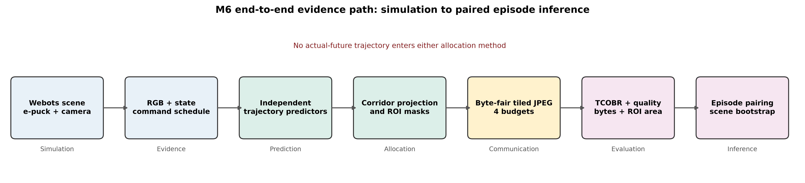
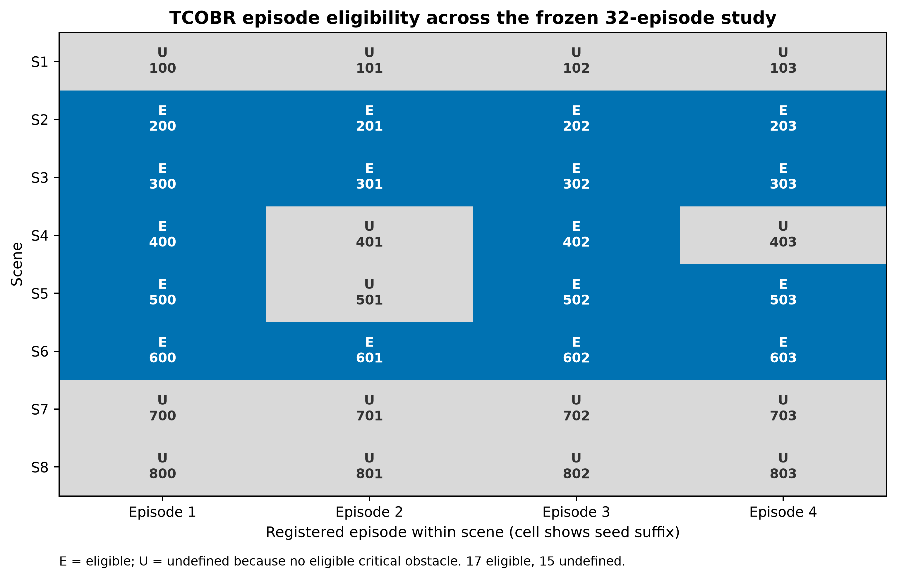
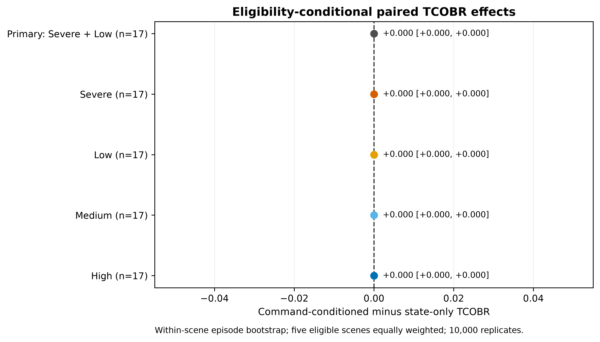
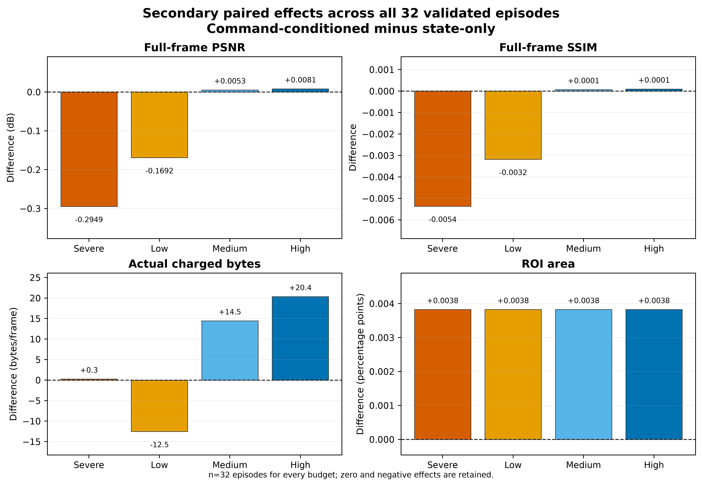
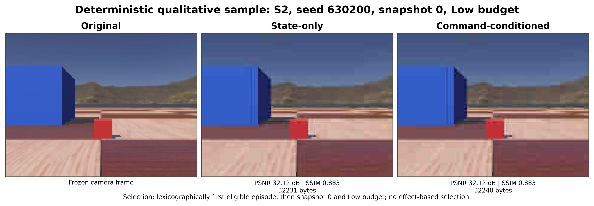

# M6 Final Multi-Scene Report

Status: **completed and frozen as a negative-result baseline**

Evidence scope: Webots R2025a simulation, 32 formal episodes, 8 scenes

Statistical unit: episode

## Executive conclusion

The original eight-scene TCOBR support gate is **NOT EVALUATED** because S1, S7, and S8 contain no eligible trajectory-critical obstacle instances. The committed eligibility-conditional analysis uses every eligible episode from S2–S6 (`n=17`) and returns **FAIL**: the command-conditioned minus state-only Severe/Low TCOBR effect is `0.000000`, with a 95% percentile bootstrap CI of `[0.000000, 0.000000]`.

This result does not support the proposition that adding the predefined future command schedule improves trajectory-critical obstacle boundary recall under the frozen M6 conditions. It is retained as a negative baseline, not reinterpreted as equivalence or proof that commands can never be useful.

## Frozen study

The additive v3 study contains 32 disjoint formal episodes: four seeds in each of S1–S8 (`630100`–`630803`). Each episode contributes four snapshots, two allocation methods, and four budgets, yielding 32 codec cases per episode and 1,024 validated cases overall.

The compared methods are:

- `state_only_risk_roi`: current pose and current twist only;
- `command_conditioned_risk_roi`: the same current state plus the predefined future command schedule available at decision time.

The methods share the 2 s horizon, 0.032 s integration step, footprint, corridor rule, projection, rasterization, codec, and budgets. Actual future trajectories, combined/oracle masks, fallback, and replacement are prohibited.



*Figure 1. End-to-end evidence path. All runtime and analysis artifacts are identity-bound and canonical; actual-future motion is excluded from allocation.*

## Primary measure and inference

Trajectory-Critical Obstacle Boundary Recall (TCOBR) is defined in [`m6_followup_evaluation_protocol.md`](m6_followup_evaluation_protocol.md). A critical obstacle is selected independently of method by the union of the frozen planned and state corridors. Eligible projected instances require at least 64 clipped pixels and 16 original boundary-edge pixels. Reconstruction edges match within one pixel, and instance recall requires boundary recall of at least 0.50.

The original preregistration specifies an episode-paired, eight-scene bootstrap. Eligibility made three scene strata empty, so that gate remains `NOT EVALUATED`. Before outcomes were calculated, the committed amendment defined a conditional analysis:

- include all 17 eligible episodes from S2–S6;
- resample episodes within scene;
- weight the five eligible scenes equally;
- use 10,000 replicates, seed `20260724`, and a 95% percentile interval;
- pass only when the CI lower bound is above zero;
- never impute an undefined episode.

## Eligibility



*Figure 2. Episode eligibility by scene and registered seed suffix. Blue cells are eligible; gray cells are undefined because they contain no eligible critical obstacle.*

| Scene | Eligible | Registered | Analysis status |
| --- | ---: | ---: | --- |
| S1 | 0 | 4 | Empty stratum |
| S2 | 4 | 4 | Included |
| S3 | 4 | 4 | Included |
| S4 | 2 | 4 | Included eligible episodes only |
| S5 | 3 | 4 | Included eligible episodes only |
| S6 | 4 | 4 | Included |
| S7 | 0 | 4 | Empty stratum |
| S8 | 0 | 4 | Empty stratum |
| **Total** | **17** | **32** | 15 undefined; no imputation |

All 15 exclusions have the preregistered reason `no_eligible_critical_obstacles`. No episode is excluded based on effect direction or magnitude.

## TCOBR results



*Figure 3. Command-conditioned minus state-only TCOBR. Points are five-scene equal-weight means and intervals use 10,000 within-scene episode bootstrap replicates. All observed effects and intervals are exactly zero.*

| Contrast | Effect | 95% CI | Gate |
| --- | ---: | ---: | --- |
| Original S1–S8 | Undefined | Undefined | **NOT EVALUATED** |
| Conditional Severe + Low | 0.000000 | [0.000000, 0.000000] | **FAIL** |
| Severe | 0.000000 | [0.000000, 0.000000] | Secondary |
| Low | 0.000000 | [0.000000, 0.000000] | Secondary |
| Medium | 0.000000 | [0.000000, 0.000000] | Secondary |
| High | 0.000000 | [0.000000, 0.000000] | Secondary |

Every eligible scene-level mean is also zero at every budget. The result therefore has no observed scene heterogeneity within S2–S6, but this must not be generalized to the three undefined scenes.

## Secondary results across all episodes

PSNR, SSIM, charged bytes, and ROI area are defined independently of TCOBR eligibility and use all 32 validated episodes.



*Figure 4. Mean paired effects across all episodes. Positive means command-conditioned minus state-only. Severe and Low preserve the observed full-frame degradation; byte and area differences are reported without interpreting them as task benefits.*

| Budget | PSNR effect (dB) | SSIM effect | Charged-byte effect (bytes/frame) | ROI-area effect (percentage points) |
| --- | ---: | ---: | ---: | ---: |
| Severe | -0.294868 | -0.005369 | +0.266 | +0.003825 |
| Low | -0.169179 | -0.003182 | -12.547 | +0.003825 |
| Medium | +0.005307 | +0.000067 | +14.453 | +0.003825 |
| High | +0.008105 | +0.000096 | +20.359 | +0.003825 |

The Low-budget result is adverse in both full-frame measures despite slightly fewer charged bytes. The Severe result is more adverse in full-frame quality while charged bytes are effectively matched. Medium and High differences are small and positive.

## Qualitative audit sample



*Figure 5. The sample rule is independent of effect: lexicographically first eligible episode, then snapshot 0 and Low budget. State-only and command-conditioned reconstructions are pixel-identical in this example; the plotted images were reconstructed from frozen evidence and verified against recorded SHA-256 digests.*

The selected sample is S2 seed 630200, snapshot 0. State-only uses 32,231 charged bytes and command-conditioned uses 32,240; both have PSNR 32.12 dB and SSIM 0.883. It is illustrative evidence only and does not replace the episode-level analysis.

## Engineering contributions

1. A leakage-resistant, method-specific predictor-to-mask interface.
2. Shared trajectory-to-corridor-to-projection configuration with deterministic provenance.
3. A one-shot Webots lifecycle with canonical runtime and completion evidence.
4. Complete-container byte-fair codec evaluation with no fallback or replacement.
5. Strict manifest/package/runtime identity validation and tamper rejection.
6. Episode-level analysis that retains null, negative, and undefined results.

## Limitations

- The evidence is simulation-only and does not measure collision rate, navigation success, latency, or physical network behavior.
- TCOBR eligibility is sparse: 15/32 episodes are undefined and three scene strata are empty.
- The edge-recall thresholded endpoint may be insensitive when both reconstructions preserve the same eligible boundaries.
- The two methods are heuristic baselines operating on a small `160x120` image and deterministic static-AABB scenes.
- Equal TCOBR does not prove method equivalence, nor does it prove future commands have no visual value in other scenes or allocation models.
- Secondary quality effects are small averages with heterogeneous episode-level values and are not preregistered safety outcomes.

## Frozen artifacts and reproducibility

Tracked scientific contracts:

- [`results/m6_multiscene_v3_preregistration.json`](results/m6_multiscene_v3_preregistration.json)
- [`results/m6_v3_eligibility_conditional_analysis_amendment.json`](results/m6_v3_eligibility_conditional_analysis_amendment.json)
- [`results/m6_v3_preanalysis_identity_correction.md`](results/m6_v3_preanalysis_identity_correction.md)
- [`figures/data/`](figures/data/) publication source tables

Local immutable analysis artifacts:

- `results/m6_multiscene_formal_v3/analysis_summary.json`
- `results/m6_multiscene_formal_v3/episode_effects.csv`
- `results/m6_multiscene_formal_v3/secondary_episode_effects.csv`
- `results/m6_multiscene_formal_v3/study_report.md`

Regenerate all publication figures without Webots:

```powershell
.\.venv\Scripts\python.exe -m scripts.plot_m6_publication_figures
```

The figure source tables preserve the exact negative and undefined results. The rendering command creates SVG plus 360-dpi PNG files with fixed typography, dimensions, palette, and SVG hash salt.

## Release decision and next milestone

M6 is complete and frozen as a negative-result baseline. No further reinterpretation, scene replacement, eligibility imputation, or tuning against these outcomes is permitted.

The next milestone is **budget-conditioned visual value of information combining risk, coverage, and task utility**. It should first establish eligibility-rich held-out scenes and method-independent counterfactual tile-quality data, then evaluate deterministic marginal utility per actual byte before considering a learned allocator. Closed-loop safety claims require a separate preregistered task experiment.
